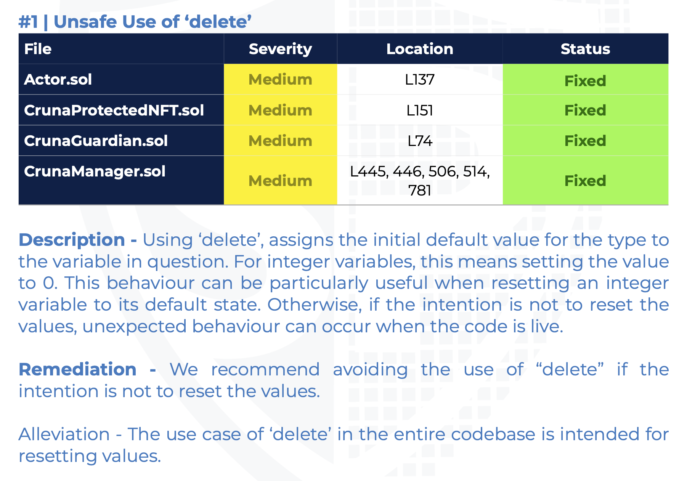

# Note to SolidProof Audit

The audit report incorrectly flags one of the issues. Attached is a screenshot for reference:

The audit describes the issue as follows:

> Using ‘delete’, assigns the initial default value for the type to
the variable in question. For integer variables, this means setting the value
to 0. **This behaviour can be particularly useful when resetting an integer
variable to its default state.** Otherwise, if the intention is not to reset the
values, unexpected behaviour can occur when the code is live.

In our implementation, we deliberately use the delete operator to reset values, adhering to best practices. A comparison between the audited commit and the latest commit will show that no changes were made in this regard. Therefore, the "Fixed" label is mistakenly applied, and the issue should have been considered non-applicable.